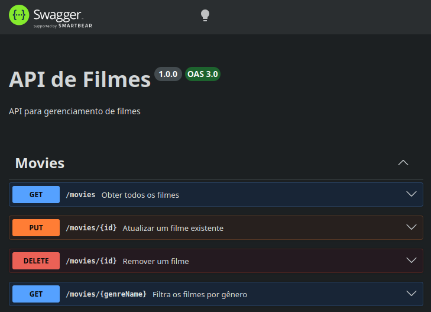

# MovieFlix API

## 📋 Descrição

API RESTful para gerenciamento de filmes, desenvolvida com Node.js e Express.

## 🛠️ Conceitos e Tecnologias

- **Node.js** - Runtime JavaScript
- **Express** - Framework web
- **PostgreSQL** - Banco de dados SQL
- **Prisma** - ORM para SQL
- **Swagger** - Documentação interativa da API

## 📦 Pacotes Principais

```json
{
    "express": "^5.2.1",
    "swagger-ui-express": "^5.0.1",
    "prisma": "^4.13.0",
    "tsx": "^4.21.0",
    "typescript": "^5.9.3"
}
```

## 🚀 Como Usar

### 1. Clonagem do repositório

SSH:

```bash
git clone git@github.com:Williaw-Al/movieflix-devquest.git
cd movieflix-api
```

HTTP:

```bash
git clone https://github.com/Williaw-Al/movieflix-devquest.git
cd movieflix-api
```

### 2. Instalação das dependências

```bash
npm install
```

### 3. Configuração do Banco de Dados

Crie um arquivo `.env` com as variáveis necessárias.

### 4. Iniciar o servidor

```bash
npm start
```

### 5. Acessar Swagger

Acesse `http://localhost:3000/docs` para explorar a API interativamente sem ferramentas externas.



- GET: Retorna uma lista de filmes em ordem alfabética. Se específicado o nome do gênero, filtra a lista para retornar apenas os filmes selecionados;

- PUT: Atualiza um filme utilizando as informações dentro do body da requisição;

- DELETE: Remove o filme escolhido da lista;

## 📚 Evoluindo

Essa API possui as funcionalidades básicas de um banco de dados funcional, feita como parte do curso DevQuest.

O próximo passo é criar uma API mais autoral, possivelmente com a temática de aves (corujas) 🦉️.
